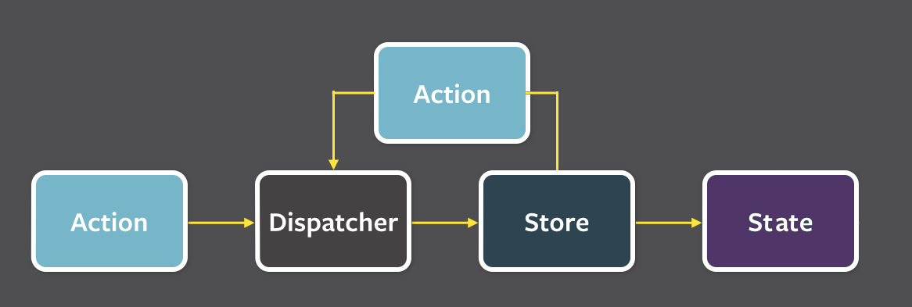

# Flux implementation

In this project I did my own [Facebook flux](https://facebook.github.io/flux/) implementation. 

- It's my first attempt to create flux
- It's not perfect
- It's not usable for other project 

I recommending to use [Redux](https://github.com/rackt/redux) by [Dan Abramov](https://twitter.com/dan_abramov), check his [great tutorial](https://egghead.io/series/getting-started-with-redux) on egghead.

## Minimal Implementation



**Creating Dispatcher**

First, we need to create dispatcher, which will receive action and dispatch it to all stores connected to dispatcher. 
There's should be only one dispatche for whole application, but you can create another dispatcher for critical sections.

```js
const dispatcher = CreateDispatcher();
```
 
**Creating Store(s)**

Stores are holding state of application and receving action from dispatcher `handleAction` which will create new store's state.
They also have `initState`.If you want to dispatch new action, then put it in return statement. 
 
```js
const myStore = CreateStore({
    initState: {
        // Put here initial store's state or leave it empty
    },
    handleAction: {
        DEFAULT: (state, action) => {
            // When dispatcher dispatch unknown action to store, it'll evooke DEFAULT
            console.log(`myStore received: unknown action`);
            return {state: state, action: null};
        },
        SOME_ACTION: (state, action) => {
            console.log(`myStore received: SOME_ACTION`);
            return {state: state, action: null}
        },
        // Feel free to add another action
    }
});
```

*- it isn't necessery to return action property in return statement of action*


**Mounting store(s) to Dispatcher**

```js
// Store will now receiving actions from dispatcher
dispatcher.mount(myStore);  
```

**Actions**

Action is object with it's `type` (or name) and `payload`. They can be also received in JSON from server.

```json
{
    type: "MY_ACTION",
    payload: {}
    
}
```

```js
const myAction = {
    type: 'MY_ACTION',
    payload: {}
};
```

and then dispatched

```js
dispatcher.dispatch(myAction);
```

or dispatched with callback function

```js
dispatcher.dispatch(myAction, (arrayOfStatesFromStores) => {});
```


